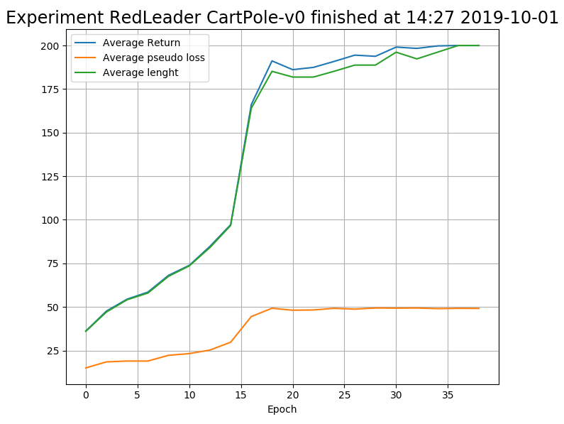

[**Deep Reinforcement Learning**](https://github.com/RedLeader962/LectureDirigeDRLimplementation/tree/master)

 

# :: Advantage Actor-Critic

Advantage Actor-Critic method are close cousin of Policy Gradient class algorithm. The difference is that they use two neural networks instead of one: the **actor** who has the responsibility of finding the best action given a observation and the **critic** who has the responsibility of assessing if the actor does a good job.

**The two main goals of this essay** were to first, get a deeper understanding of Actor-Critic method theoric aspect and second, to acquire a practical understanding of it’s beavior, limitation and requirement in order to work. In order to reach this second goal, I felt it was nescessary to implement multiple design & architectural variation commonly found in the litterature.
  
With this in mind, I’ve focused on the following practical aspect:
- **Algorithm type**: batch vs online;
- **Computation graph**: split network vs split network (with shared lower layer) vs shared network;
- **Critic target**: Monte-Carlo vs bootstrap estimate;
- **Math computation**: element wise vs graph computed;
- Various **Data collection** strategy;
        
        
In parallel, I writen a second essay _A reflexion on design, architecture and implementation details_ where I go further in my study of somme aspect of DRL algortihm from a software engineering perspective applied to research by covering question like:

**Does implementation details realy matters? Which one does, when & why?**


I've also complemented my reading with the following ressources:

- The classic book [Reinforcement learning: An introduction 2nd ed.](http://incompleteideas.net/book/RLbook2018.pdf) by Sutton & Barto (ed MIT Press)
- [CS 294--112 Deep Reinforcement Learning](http://rail.eecs.berkeley.edu/deeprlcourse-fa18/): lecture on Policy Gradient and Actor-Critic by Sergey Levine from University Berkeley;
- [OpenAI: Spinning Up: Intro to Policy Optimization](https://spinningup.openai.com/en/latest/spinningup/rl_intro3.html), by Josh Achiam;
- and [Lil' Log blog:Policy Gradient Algorithms](https://lilianweng.github.io/lil-log/2018/04/08/policy-gradient-algorithms.html) by Lilian Weng, research intern at OpenAI
- [Asynchronous Methods for Deep Reinforcement Learning.](https://arxiv.org/abs/1602.01783) by Mnih et al.  
- [Reinforcement learning that matters](https://arxiv.org/abs/1709.06560) by Henderson et al. 
- [TD or not TD: Analyzing the Role of Temporal Differencing in Deep Reinforcement Learning ](http://arxiv.org/abs/1806.01175) by Amiranashvili, Dosovitskiy, Koltun & Brox 
- [High-Dimensional Continuous Control Using Generalized Advantage Estimation](https://arxiv.org/abs/1506.02438) by Schulman, Moritz, Levine, Jordan & Abbeel

---
Download the essay pdf:
- [Deep Reinforcement Learning – Actor-Critic](https://github.com/RedLeader962/LectureDirigeDRLimplementation/raw/master/TP_actor_critic_LucCoupal_v1-1.pdf) 
- [A reflexion on design, architecture and implementation details](https://github.com/RedLeader962/LectureDirigeDRLimplementation/raw/master/Reflexion_on_design_and_architecture_LucCoupal_v1-1.pdf) 


Watch [recorded agent](../../video) 

---

### The Actor-Critic implementations:
Note: You can check explanation on how to use the package by using the `--help` flag

#### To watch the trained algorithm 

```bash
cd DRLimplementation
python -m ActorCritic --play[Lunar or Cartpole] [--play_for]=max trajectories (default=10) 
```

#### To execute the training loop
```bash
cd DRLimplementation
python -m ActorCritic --trainExperimentSpecification [--rerun] [--renderTraining] 
```
Choose `--trainExperimentSpecification` between the following:
- **_CartPole-v0_ environment:**
    - `--trainSplitMC`: Train a Batch Actor-Critic agent with Monte Carlo TD target
    - `--trainSplitBootstrap`: Train a Batch Actor-Critic agent with bootstrap estimate TD target
    - `--trainSharedBootstrap`: Train a Batch Actor-Critic agent with shared network
    - `--trainOnlineSplit`: Train a Online Actor-Critic agent with split network
    - `--trainOnlineSplit3layer`: Train a Online Actor-Critic agent with split network
    - `--trainOnlineShared3layer`: Train a Online Actor-Critic agent with Shared network
    - `--trainOnlineSplitTwoInputAdvantage`: Train a Online Actor-Critic agent with split Two input Advantage network
- **_LunarLander-v2_ environment:**
    - `--trainOnlineLunarLander`: Train on LunarLander a Online Actor-Critic agent with split Two input Advantage network
    - `--trainBatchLunarLander`: Train on LunarLander a Batch Actor-Critic agent 


#### To navigate trough the computation graph in TensorBoard
```bash
cd DRLimplementation
tensorboard --logdir=ActorCritic/graph
```

# TODO !!!!!




---
