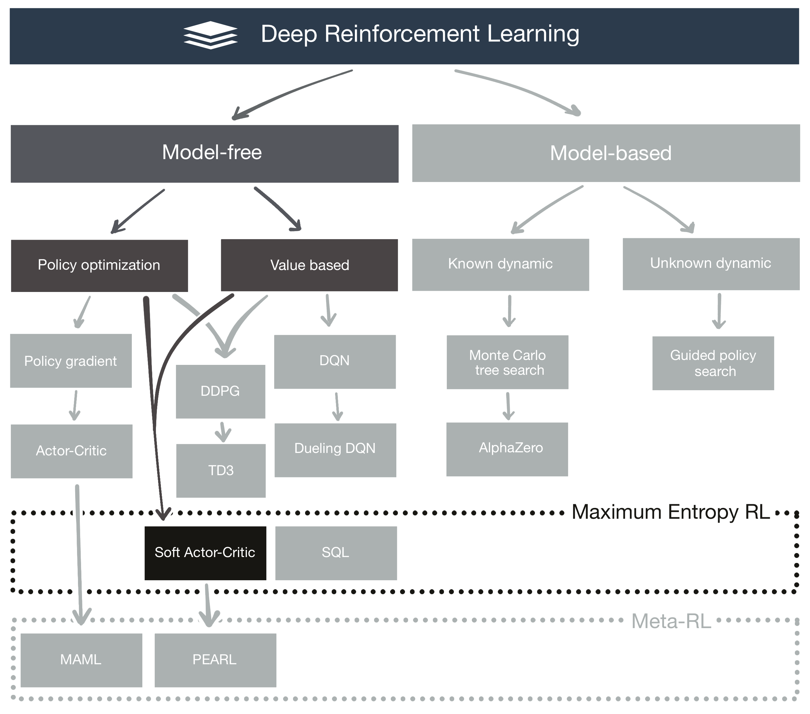

[**Deep Reinforcement Learning**](https://github.com/RedLeader962/LectureDirigeDRLimplementation/tree/master)

 

# :: Soft Actor-Critic


Soft Actor-Critic (_SAC_) is an off-policy algorithm based on the _Maximum Entropy_ _Reinforcement Learning_ framework.
The main idea behind _Maximum Entropy RL_ is to frame the decision-making problem as a graphical model from top to bottom and then solve it using tools borrowed from the field of _Probabilistic Graphical Model_ Under this framework, a learning agent seeks to maximize both the return and the entropy simultaneously.
This approach benefit _Deep Reinforcement Learning_ algorithm by giving them the capacity to consider and learn many alternate paths leading to an optimal goal
and the capacity to learn how to act optimally despite adverse circumstances.

Since _SAC_ is an off-policy algorithm, then it has the ability to train on samples coming from a different policy.
What is particular though is that contrary to other off-policy algortihm, it's stable. This mean that the algorithm is much less picky in term of hyperparameter tuning.

[_SAC_](https://arxiv.org/abs/1801.01290) is curently **the state of the art** _Deep Reinforcement Learning_ algorithm together with Twin Delayed Deep Deterministic policy gradient [(_TD3_)](https://arxiv.org/abs/1802.09477) 


The learning curve of the _Maximum Entropy RL_ framework is quite steep due to it's depth and to how much it re-think the RL problem. It was definitavely required in order to understand how _SAC_ work.
Tackling the applied part was arguably the most difficult project I did to date, both in term of component to implement \& silent bug dificulties.
Never the less I'm particularly proud of the result.

### Reading material:
- [Soft Actor-Critic: Off-Policy Maximum Entropy Deep Reinforcement Learning with a Stochastic Actor](https://arxiv.org/abs/1801.01290)
- [Reinforcement Learning and Control as Probabilistic Inference: Tutorial and Review](https://arxiv.org/abs/1805.00909)
- [Soft Actor-Critic Algorithms and Applications](https://arxiv.org/abs/1812.05905)
- [Reinforcement Learning with Deep Energy-Based Policies](https://arxiv.org/abs/1702.08165)
- [Deterministic Policy Gradient Algorithms](http://proceedings.mlr.press/v32/silver14.pdf)
- [Reinforcement learning: An introduction](http://incompleteideas.net/book/RLbook2018.pdf)


I've also complemented my reading with the following resources:
- [CS 294--112 _Deep Reinforcement Learning_](http://rail.eecs.berkeley.edu/deeprlcourse-fa18/): lectures 14-15 by Sergey Levine from University Berkeley
- [_OpenAI_: _Spinning Up_: _Soft Actor-Critic_](https://spinningup.openai.com/en/latest/algorithms/sac.html)  by Josh Achiam;
- and also  [_Lil' Log blog:Policy Gradient Algorithms_](https://lilianweng.github.io/lil-log/2018/04/08/policy-gradient-algorithms.html#sac)  by Lilian Weng, research intern at _OpenAI_


---
Download the essay pdf:
- [Deep Reinforcement Learning – Soft Actor-Critic](https://github.com/RedLeader962/LectureDirigeDRLimplementation/raw/master/TP_SoftActorCritic_LucCoupal_v1-0.pdf) 


[Watch mp4 video - Soft Actor-Critic Post training - Test run on 2X harder LunarLanderContinuous-v2 environment](video/SAC_video/SAC_postTraining_testOnHardLunar540p.mp4) 
---

### The Soft Actor-Critic implementation:
Note: You can check explanation on how to use the package by using the `--help` flag

#### To watch the trained algorithm 

```bash
cd DRLimplementation
python -m SoftActorCritic [--playLunar, --playHardLunar, --playPendulum] [--record] 
                            [--play_for]=max trajectories (default=10) [--harderEnvCoeficient=1.6] (default)
```

#### To execute the training loop
```bash
cd DRLimplementation
python -m SoftActorCritic < trainExperimentSpecification > [--rerun] [--renderTraining] 
```
Choose `< trainExperimentSpecification >` between the following:
- For _BipedalWalker-v2_ environment:
    `[--trainBipedalWalker]`: Train on Bipedal Walker gym env a Soft Actor-Critic agent
- For _Pendulum-v0_ environment:
    `[--trainPendulum]`: Train on Pendulum gym env a Soft Actor-Critic agent
- For _LunarLanderContinuous-v2_ environment:
    `[--trainLunarLander]`: Train on LunarLander a Soft Actor-Critic agent
- Experimentation utility:
    `[--trainExperimentBuffer]`: Run a batch of experiment spec


#### To navigate trough the computation graph in TensorBoard
```bash
cd DRLimplementation
tensorboard --logdir=SoftActorCritic/graph
```


---
