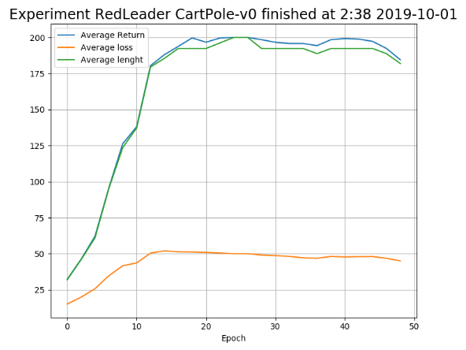

Repository for the course IFT-7014: Directed reading on
# Deep Reinforcement Learning 

by **Luc Coupal**,
Université Laval,
Montréal, QC, Canada,
[Luc.Coupal.1@uLaval.ca](Luc.Coupal.1@uLaval.ca) 

#### Under the supervision of:

**Professor Brahim Chaib-draa**,
Directeur du programme de baccalauréat en génie logiciel de l'Université Laval,
Québec, QC, Canada,
[Brahim.Chaib-draa@ift.ulaval.ca](Brahim.Chaib-draa@ift.ulaval.ca)


---

#### Dependencies:
    'gym>=0.14.0'
    'tensorflow>=1.14.0,<2.0',
    'matplotlib>=3.1.0',
    'numpy>=1.16.4',
    'seaborn>=0.9.0',
    'pytest',
    
#### Install instruction:
1) **Create & activate a new virtuel environment** (I recommand using [conda](https://www.anaconda.com/distribution/), ... it's a walk in the park)
    ```bash
    conda create --name myNewVirtualEnvironmentName python=3.7
    conda activate myNewVirtualEnvironmentName
    ```
2) **Clone the GitHub repository & install**:
    ```bash
    git clone https://github.com/RedLeader962/LectureDirigeDRLimplementation.git
    cd LectureDirigeDRLimplementation
    pip install -e .
    ```
3) **Enjoy** DRL script

---

**First of many:**

## [Basic policy gradient](https://github.com/RedLeader962/LectureDirigeDRLimplementation/tree/master/DRL-TP1-Policy-Gradient)
Policy gradient is a on-policy method which seek to directly optimize the policy  by using sampled trajectories as weight. Those weights will then be used to indicate how good the policy performed. Based on that knowledge, the algorithm updates the parameters of his policy to make action leading to similar good trajectories more likely and similar bad trajectories less likely. In the case of Deep Reinforcement Learning, the policy parameter is a neural net. For this essay, I've studied and implemented the basic version of policy gradient also known as REINFORCE. I've also complemented my reading with the following ressources:

- [CS 294--112 Deep Reinforcement Learning](http://rail.eecs.berkeley.edu/deeprlcourse-fa18/): lecture 4, 5 and 9 by Sergey Levine from University Berkeley;
- [OpenAI: Spinning Up: Intro to Policy Optimization](https://spinningup.openai.com/en/latest/spinningup/rl_intro3.html), by Josh Achiam;
- and also [Lil' Log blog:Policy Gradient Algorithms](https://lilianweng.github.io/lil-log/2018/04/08/policy-gradient-algorithms.html) by Lilian Weng, research intern at OpenAI

---

### The REINFORCE implementation:
**To watch the trained algorithm**

```bash
cd DRLTP1PolicyGradient/
python REINFORCEplayingloop.py 
```

**To execute the training loop**
```bash
cd DRLTP1PolicyGradient/
python REINFORCEtrainingloop.py
```

**To navigate trough the computation graph in TensorBoard**
```bash
tensorboard --logdir=DRL-TP1-Policy-Gradient/graph/
```

To see [video example](video/) 




---

