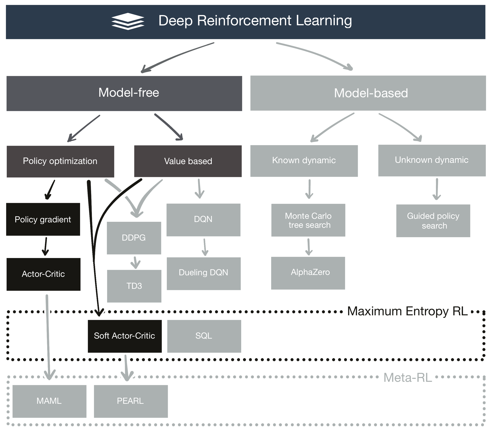

[](https://sonarcloud.io/dashboard?id=RedLeader962_LectureDirigeDRLimplementation)
[](https://sonarcloud.io/dashboard?id=RedLeader962_LectureDirigeDRLimplementation)
[](https://codecov.io/gh/RedLeader962/LectureDirigeDRLimplementation)


Repository for the course IFT-7014: Directed reading on
# Deep Reinforcement Learning 

by **Luc Coupal**,
Université Laval,
Montréal, QC, Canada,
[Luc.Coupal.1@uLaval.ca](Luc.Coupal.1@uLaval.ca) 

#### Under the supervision of:

**Professor Brahim Chaib-draa**,
Directeur du programme de baccalauréat en génie logiciel de l'Université Laval,
Québec, QC, Canada,
[Brahim.Chaib-draa@ift.ulaval.ca](Brahim.Chaib-draa@ift.ulaval.ca)

---
 


### Essay on:
- Maximum Entropy RL:
  - **[Soft Actor-Critic](DRLimplementation/SoftActorCritic)**
- Classical RL:
  - **[Actor-Critic](DRLimplementation/ActorCritic)**
  - **[Basic policy gradient](DRLimplementation/BasicPolicyGradient)**
- Meta-DRL
- **[A reflexion on design, architecture and implementation details](https://github.com/RedLeader962/LectureDirigeDRLimplementation/raw/master/Reflexion_on_design_and_architecture_LucCoupal_v1-1.pdf)**

---


[Watch mp4 video - Soft Actor-Critic Post training - Test run on 2X harder LunarLanderContinuous-v2 environment](video/SAC_video/SAC_postTraining_testOnHardLunar540p.mp4) 

---
    
### Install instruction:
1) **Create & activate a new virtual environment** (I recommand using [conda](https://www.anaconda.com/distribution/), ... it's a walk in the park)
    ```bash
    conda create --name myNewVirtualEnvironmentName python=3.7
    conda activate myNewVirtualEnvironmentName
    ```
2) **Clone** the GitHub repository & **install dependencies**:
    ```bash
    git clone https://github.com/RedLeader962/LectureDirigeDRLimplementation.git
    cd LectureDirigeDRLimplementation
    pip install -e .
    ```
    This will automaticaly install those **dependencies** in `myNewVirtualEnvironmentName` :

        'gym>=0.14.0'
        'tensorflow>=1.14.0,<2.0',
        'matplotlib>=3.1.0',
        'numpy>=1.16.4',
        'seaborn>=0.9.0',
        'pytest',
    
3) **Enjoy** DRL script

---

